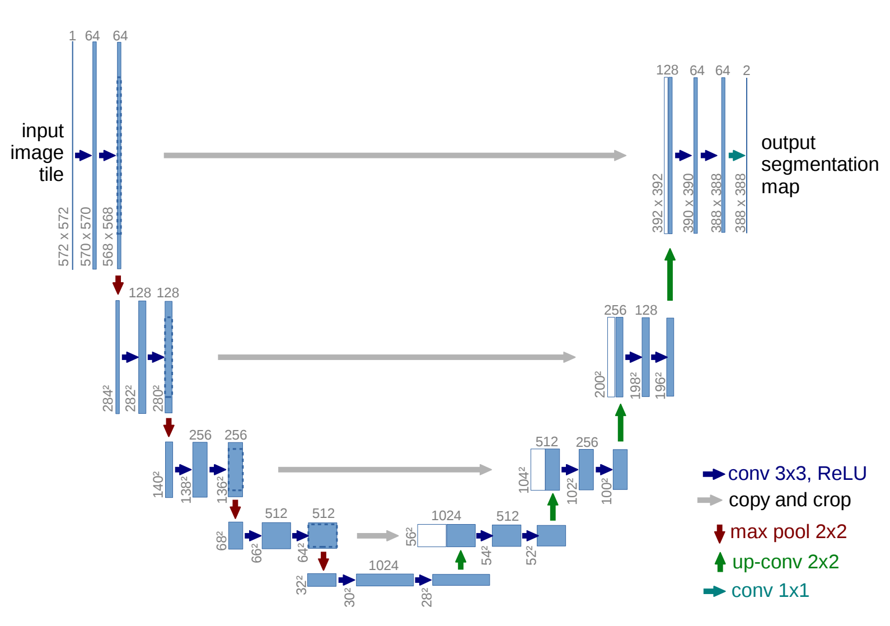
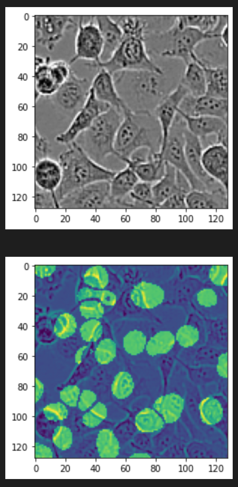

# Cell Nuclei Segmentation using U-Net

  <kbd></img></kbd>

<em>Figure 1: U-Net Architecture for Cell Nuclei Segmentation</em>

## Project Overview
The goal of this project is to develop a neural network using TensorFlow and Keras to perform cell nuclei segmentation in microscopy images. The chosen architecture for this task is the U-Net, a convolutional neural network (CNN) designed for biomedical image segmentation.

## Dataset Description
The training data consists of 2000 microscopy images of cells, stored in a numpy array X, and corresponding segmentation masks stored in a numpy array y. Each image (and each corresponding mask) has shape (128, 128). The segmentation mask y[i] for image X[i] contains "soft labels" (that is, numbers between 0 and 1) which tell you which pixels in the image X[i] belong to a cell nucleus.

The test data consists of 2000 more images of cells. No masks are provided for the test images.

## Model Performance 
The performance of the U-Net model for cell nuclei segmentation was evaluated on both the validation and test sets. The key metrics used for assessment was accuracy and loss on the validation set and mean absolute error on the test set on Kaggle. 

| Metric | Value |
| --- | --- |
| Validation Accuracy | 0.8287 |
| Validation Loss | 0.5083 |
| Test Mean Absolute Error | 1.9020 |

  <kbd></img></kbd>

<em>Figure 2: Nuclei prediction mask example</em>

## Conclusion
This project provides a foundation for developing a U-Net model for cell nuclei segmentation. Feel free to experiment with different architectures, optimization strategies, and data augmentation techniques to enhance the model's performance on your particular dataset.